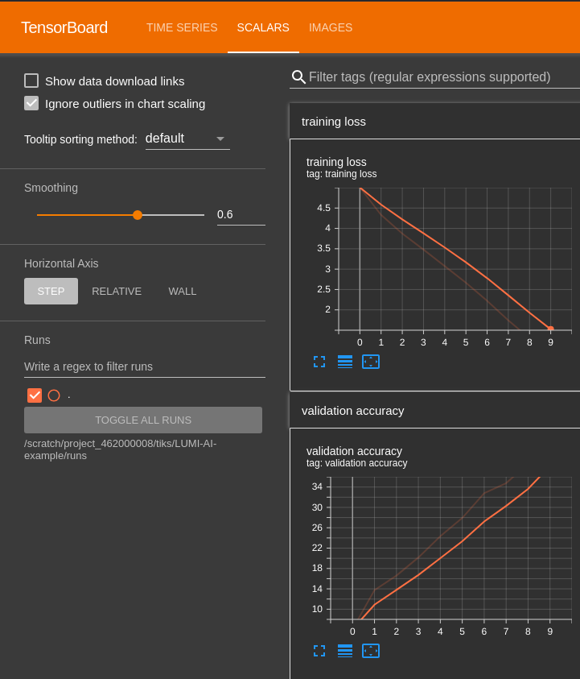

# TensorBoard visualization

[TensorBoard](https://www.tensorflow.org/tensorboard) is a tool for providing the measurements and visualizations needed during the machine learning workflow. It enables tracking experiment metrics like loss and accuracy, visualizing the model graph, projecting embeddings to a lower dimensional space, and much more.

## Collecting logs

Tensorboard can be used to [visualize models, data, and training with PyTorch](https://pytorch.org/tutorials/intermediate/tensorboard_tutorial.html). We can also configure Tensorboard to collect metrics from distributed execution. We will use the VisualTransformer classification example, which utilizes Distributed Data Parallel for distributed execution, and adapt it to collect some metrics to Tensorboard. 

Since during distributed runs we use  multiple processes, we set one of the processes to be responsible for collecting the logs. This can be done via using the `rank` environment variable assigned to every process created by Slurm. We can use this variable to assign the task of logging to the first process - rank 0. With just a few additions we can display some of the training images and loss, but additional metrics can be added using similar methods. 

We can start the logger, called SummaryWriter, on the first process to generate logs into the directory `runs` as follows:
```bash
from torch.utils.tensorboard import SummaryWriter
    
if rank == 0:
    writer = SummaryWriter('runs')
```

After having configured the logger, we can visualize some of the images we use as a grid with Matplotlib like so:

```bash
import matplotlib.pyplot as plt

def matplotlib_imshow(img, one_channel=False):
    if one_channel:
        img = img.mean(dim=0)
    img = img / 2 + 0.5     # unnormalize
    npimg = img.numpy()
    if one_channel:
        plt.imshow(npimg, cmap="Greys")
    else:
        plt.imshow(np.transpose(npimg, (1, 2, 0)))
...
if rank == 0:
    dataiter = iter(train_loader)
    images, labels = next(dataiter)
    # create grid of images
    img_grid = torchvision.utils.make_grid(images)
    # show images
    matplotlib_imshow(img_grid, one_channel=True)
    # write to tensorboard
    writer.add_image('images', img_grid)
```

The images will then be visualized in TensorBoard similar to the following:


Graphs of the training loss and validation accuracy can also be gathered with the addition of 2 lines of code:
```bash
if rank == 0:
    print(f'Epoch {epoch+1}, Loss: {running_loss/len(train_loader)}')
    writer.add_scalar('training loss', running_loss / len(train_loader), epoch)
...
if rank == 0:
    print(f'Accuracy: {100 * correct / total}%')
    writer.add_scalar('validation accuracy', 100*correct/total , epoch)

```
In TensorBoard, the collected data will be visualized similar to the following:



For a full example that integrates TensorBoard to the DDP script, have a look at [tensorboard_ddp_visualtransformer.py](tensorboard_ddp_visualtransformer.py). For the batch script there are no changes required except for replacing [ddp_visualtransformer.py](../multi-gpu-and-node/ddp_visualtransformer.py) with [tensorboard_ddp_visualtransformer.py](tensorboard_ddp_visualtransformer.py).

## Visualizing the logs

TensorBoard can be used on LUMI via the [web interface](https://docs.lumi-supercomputer.eu/runjobs/webui/) by selecting "TensorBoard" from the "Apps" menu. Once you have the logs generated during execution, you can launch the TensorBoard server on a compute node, display the GUI and analyze the run.


To launch it, select the log directory where you have data to visualize, which in this case would be the path to the `runs` directory, and the resources for the Slurm job.

Note that TensorBoard is very memory intensive but has low CPU usage.

 ### Table of contents

- [Home](../README.md)
- [QuickStart](../quickstart/quickstart.md)
- [Setting up your own environment](../setting-up-environment/setup_environment.md)
- [File formats for training data](../file-formats/file_formats.md) 
- [Data Storage Options](../data-storage/data_storage.md)
- [Multi-GPU and Multi-Node Training](../multi-gpu-and-node/multi_gpu_and_node.md)
- [Monitoring and Profiling jobs](../monitoring-and-profiling/profiling.md)
- [TensorBoard visualization](../TensorBoard-visualization/tensorboard_visualization.md)
- [MLflow visualization](../MLflow-visualization/mlflow_visualization.md)
