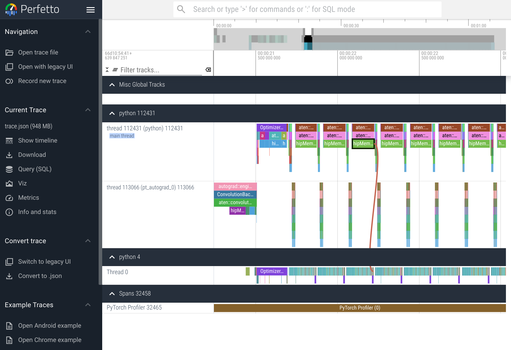

# Monitoring and Profiling jobs

> [!NOTE]  
> If you wish to run the included examples on LUMI, have a look at the [quickstart](../quickstart/README.md) chapter for instructions on how to set up the required environment.

When running jobs on LUMI's GPUs, you want to make sure you use the given computational resources as efficiently as possible. Your project will be billed for the number of GPUs you allocate times the number of hours you use them. If you only utilize half of the GPUs computational power, you are still billed for the full GPU, resulting in wasted resources and money. In this chapter, we will show how to monitor and profile your jobs to ensure you are using the resources efficiently.

## Monitoring jobs with `rocm-smi`

The `rocm-smi` tool is a command-line utility that allows you to monitor the status of the GPUs on LUMI. Let's start with the [visualtransformer.py](../quickstart/visualtransformer.py) script from the [QuickStart](../quickstart/README.md) chapter that runs on a single GPU. We submit the job with the following command:

```bash
sbatch run.sh
```

We can check the `jobid` of the job with the `squeue --me` command and open an interactive parallel session (replace `8704360` with the `jobid` of your job) with the following command:

```bash
srun --jobid 8704360 --interactive --pty /bin/bash
```
This will open a shell on the compute node where the job is running. We can now use the `rocm-smi` tool to monitor the GPU usage. The following command will show the GPU usage updated every second:

```bash
watch -n1 rocm-smi
```

The output will look similar to the following:


The `rocm-smi` tool shows multiple useful metrics such as GPU utilization, memory usage, temperature, and power usage. The most intuitive metrics might be GPU utilization and memory usage, they are however not accurate indicators whether the GPU is fully utilized as a kernel waiting idle for data shows in the driver as 100% GPU utilization. The best indicator is instead the drawn power. For a single GPU, a power usage of around 300W is a good indicator that the full GPU is being leveraged. 

Let's have a look at the [ddp_visualtransformer.py](../multi-gpu-and-node/ddp_visualtransformer.py) example from the [Multi-GPU and Multi-Node Training](../multi-gpu-and-node/README.md) chapter that runs on 8 GPUs on one node. We submit the job with the following command:

```bash
sbatch run_ddp_torchrun.sh
```
`rocm-smi` will now show us the status of all 8 GPUs on the node:


All eight devices are now listed in the output. Note that power consumption is only listed for half of the devices. This is due to the fact that one MI250x GPU consists of two graphical compute dies (GCD). In the context of `rocm-smi` and PyTorch in general, every GCD is listed as a separate GPU, but the power budget is shared between two GCDs. When both GPUs are fully utilized, the power consumption will be around 500W.

## PyTorch profiler

Using `rocm-smi` can give us an easy way to peek at GPU utilization, but it doesn't provide any information about which parts of the code are taking the most time. For this, we can use PyTorch's built-in profiler. 
We can enable the profiler by adding the following lines around the code we wish to profile:

```python
from torch.profiler import profile, ProfilerActivity

prof = None
if epoch == 2: # In this example we profile the second epoch
    print("Starting profile...")
    prof = profile(activities=[ProfilerActivity.CPU, ProfilerActivity.CUDA])
    prof.start()

# Code to profile

if prof:
    prof.stop()
    prof.export_chrome_trace("trace.json")
```
Have a look at the [visualtransformer_profiled.py](visualtransformer_profiled.py) script for a full example. The output of the profiling will be saved in a `trace.json` file. We can visualize the trace using the Chrome browser by copying the `trace.json` file to our local machine, navigating to [ui.perfetto.dev/](https://ui.perfetto.dev/) and loading the `trace.json` file. The trace will show us the time spent in each function call, and will look similar to the following:



Note that chrome tabs are usually limited to around 2 GB of memory usage and that the trace files can become quite large and easily exceed this limit. It is therefore recommended to only profile a small part of the code that we are particularly interested in and not the full training loop.

## AMD profilers

If the framework-level profiling is not sufficient and you want to investigate hardware-level performance, you can use AMD's profiling tools. The [LUMI training materials](https://lumi-supercomputer.github.io/LUMI-training-materials/) provide multiple lectures on how to use AMD's profilers `rocprof`, `Omnitrace` and `Omniperf`. For a short introduction to `rocprof`, have a look at the lecture ["Understanding GPU activity & checking jobs"](https://lumi-supercomputer.github.io/LUMI-training-materials/ai-20241126/extra_04_CheckingGPU/) from the LUMI AI workshop. If you need a detailed introduction to all AMD profilers provided on LUMI, we recommend the lecture material of the LUMI [Performance Analysis and Optimization Workshop](https://lumi-supercomputer.github.io/LUMI-training-materials/paow-20240611/).

 ### Table of contents

- [Home](../README.md)
- [QuickStart](../quickstart/README.md)
- [Setting up your own environment](../setting-up-environment/README.md)
- [File formats for training data](../file-formats/README.md) 
- [Data Storage Options](../data-storage/README.md)
- [Multi-GPU and Multi-Node Training](../multi-gpu-and-node/README.md)
- [Monitoring and Profiling jobs](../monitoring-and-profiling/README.md)
- [TensorBoard visualization](../TensorBoard-visualization/README.md)
- [MLflow visualization](../MLflow-visualization/README.md)
